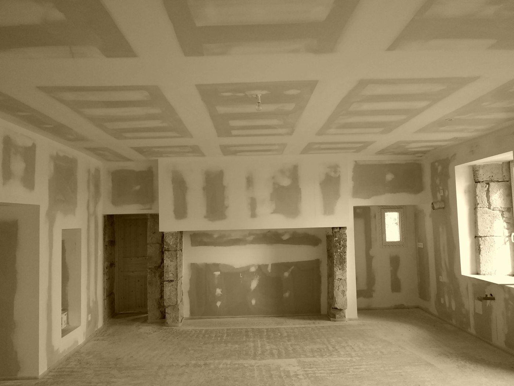
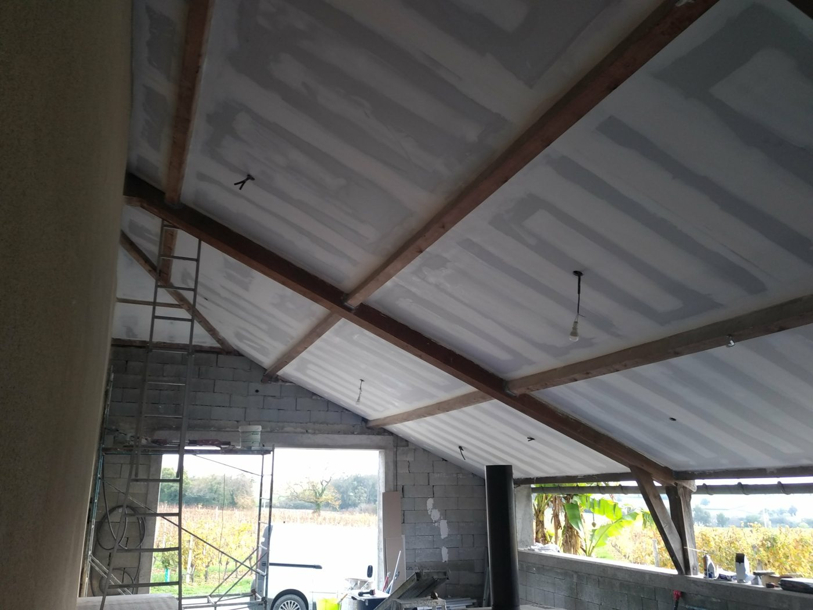
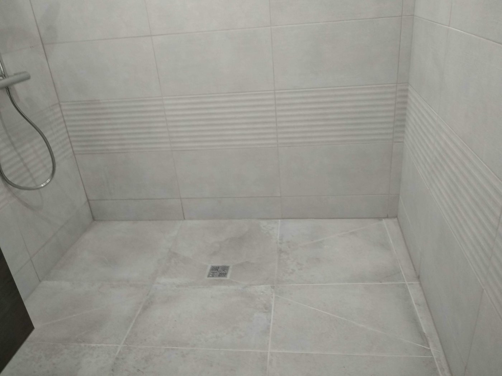

[index (2).html](https://github.com/user-attachments/files/31910920/index.2.html)
<!DOCTYPE html>
<html lang="fr">
<head>
<meta charset="UTF-8">
<meta name="viewport" content="width=device-width, initial-scale=1.0">
<title>Pellegrino Rénovation — Artisan second œuvre à Condom, Gers</title>
<meta name="description" content="Plâtrerie, isolation, carrelage et peinture. Artisan à Condom, intervient dans tout le Gers. Devis gratuit.">
<link rel="canonical" href="https://pellegrino-b8c0b2renovation.netlify.app/">
<meta property="og:type" content="website">
<meta property="og:title" content="Pellegrino Rénovation — Artisan second œuvre à Condom, Gers">
<meta property="og:description" content="Plâtrerie, isolation, carrelage et peinture. Artisan à Condom, intervient dans tout le Gers. Devis gratuit.">
<meta property="og:url" content="https://pellegrino-b8c0b2renovation.netlify.app/">
<meta property="og:image" content="https://pellegrino-b8c0b2renovation.netlify.app/images/lanne-salon-05-cheminee-caissons.jpg">
<meta property="og:locale" content="fr_FR">
<meta name="twitter:card" content="summary_large_image">
<meta name="twitter:title" content="Pellegrino Rénovation — Artisan second œuvre à Condom, Gers">
<meta name="twitter:description" content="Plâtrerie, isolation, carrelage et peinture. Artisan à Condom, intervient dans tout le Gers. Devis gratuit.">
<meta name="twitter:image" content="https://pellegrino-b8c0b2renovation.netlify.app/images/lanne-salon-05-cheminee-caissons.jpg">

<link rel="preconnect" href="https://fonts.googleapis.com">
<link rel="preconnect" href="https://fonts.gstatic.com" crossorigin>
<link href="https://fonts.googleapis.com/css2?family=Fraunces:ital,opsz,wght@0,9..144,400;0,9..144,600;0,9..144,900;1,9..144,500&family=Work+Sans:wght@400;500;600&family=IBM+Plex+Mono:wght@400;500&display=swap" rel="stylesheet">

</head>
<body>
<header class="site-nav">
  

    <a class="brand" href="index.html">Pellegrino <small>Rénovation</small></a>
    <input type="checkbox" id="nav-toggle" class="nav-toggle">
    <nav class="nav-links">
      <a class="nav-links-item active" href="index.html">Accueil</a>
<a class="nav-links-item" href="services.html">Prestations</a>
<a class="nav-links-item" href="realisations.html">Réalisations</a>
<a class="nav-links-item" href="restaurations.html">Restaurations</a>
<a class="nav-links-item" href="contact.html">Contact</a>

      <a class="nav-cta" href="contact.html">Demander un devis</a>
    </nav>
    <label for="nav-toggle" class="burger" aria-label="Ouvrir le menu">
      
    </label>
  

</header>
<section class="hero">
  

    

      Artisan à Condom · Gers (32)
      <h1>Chaque mur a une histoire. On la construit <em>avec vous</em>.</h1>
      
Plâtrerie, isolation, carrelage et peinture — un seul artisan, plâtrier-staffeur et sculpteur bas-relief de formation, du premier coup de crayon à la dernière finition, pour vos travaux de rénovation dans le Gers.

      

        <a class="btn btn-primary" href="contact.html">Demander un devis gratuit</a>
        <a class="btn btn-ghost" href="realisations.html">Voir nos réalisations</a>
      

    

    

      <svg viewBox="0 0 220 150" width="100%" height="150" role="img" aria-label="Coupe d'un mur doublé">
          <rect x="0" y="0" width="220" height="150" fill="none"/>
          <rect x="10" y="10" width="16" height="130" fill="#A79878"/>
          <rect x="26" y="10" width="34" height="130" fill="#D9CFB8"/>
          <rect x="60" y="10" width="10" height="130" fill="#5F6E52" opacity=".55"/>
          <rect x="70" y="10" width="30" height="130" fill="#EDE3CC"/>
          <rect x="100" y="10" width="8" height="130" fill="#BE5A2E"/>
          <line x1="10" y1="148" x2="108" y2="148" stroke="#24262A" stroke-width="1" stroke-dasharray="2 3"/>
        </svg>
      
COUPE — DOUBLAGE ISOLANTDTU 25.42

    

  

</section>

  

    
1Artisan, un seul interlocuteur

    
32Gers &amp; alentours

    
4Corps de métier maîtrisés

    
0€Devis, toujours gratuit

  

<section id="savoir-faire">
  

    

      Nos savoir-faire
      <h2>Une rénovation complète, sans multiplier les artisans</h2>
      
Du gros œuvre intérieur aux finitions, chaque prestation est pensée pour s'articuler avec les autres — un seul chantier, une seule équipe.

    

    

      <a class="metier-card" href="services.html#platrerie">
        

        <h3>Plâtrerie &amp; placo</h3>
        
Cloisons, doublages, faux-plafonds — structure et finition au plâtre ou en plaques de plâtre.

        Voir la prestation →
      </a>
      <a class="metier-card" href="services.html#isolation">
        

        <h3>Isolation</h3>
        
Isolation thermique et phonique des murs, combles et planchers, selon les normes en vigueur.

        Voir la prestation →
      </a>
      <a class="metier-card" href="services.html#carrelage">
        

        <h3>Carrelage</h3>
        
Pose de carrelage sol et mur, salles de bain, cuisines, terrasses — finitions soignées.

        Voir la prestation →
      </a>
      <a class="metier-card" href="services.html#peinture">
        
<svg viewBox="0 0 220 150" width="100%" height="150" role="img" aria-label="Application de peinture">
          <rect x="10" y="10" width="200" height="130" fill="#EDE3CC"/>
          <rect x="10" y="10" width="130" height="130" fill="#BE5A2E" opacity=".9"/>
          <rect x="128" y="10" width="14" height="130" fill="#8A3D1D"/>
        </svg>

        <h3>Peinture</h3>
        
Préparation des supports, peintures intérieures et extérieures, ravalement de finition.

        Voir la prestation →
      </a>
    

  

</section>

<section id="pourquoi">
  

    

      Pourquoi Pellegrino Rénovation
      <h2>Un artisan, une parole, un chantier suivi de bout en bout</h2>
    

    

      

        Proximité
        <h3>Basé à Condom</h3>
        
Une connaissance fine du bâti local et des déplacements rapides dans tout le Gers.

      

      

        Suivi direct
        <h3>Un seul interlocuteur</h3>
        
Pas d'intermédiaire : c'est moi qui chiffre, qui pose et qui vous rends compte de l'avancement.

      

      

        Transparence
        <h3>Devis clair, prix annoncé</h3>
        
Un devis détaillé avant travaux, sans surprise à la facture finale.

      

    

  

</section>

<section class="presse-section">
  

    "
    

      Presse
      <h2>Portrait dans La Dépêche du Dimanche</h2>
      
Formé dès son plus jeune âge auprès de son père André, créateur de cheminées, Eric Pellegrino a appris le métier à l'ancienne : CAP de plâtrier, puis plusieurs années au sein d'un cercle restreint d'artisans œuvrant à la restauration de bâtiments historiques classés, aux côtés des Bâtiments de France, sur des monuments à Arras et à Douai. Il y a acquis, au contact d'autres artisans, le goût du travail du bois qui vient aujourd'hui compléter sa maîtrise du plâtre et du staff.

      
Depuis l'ouverture de son propre atelier à Condom, il crée notamment des consoles de cheminée sculptées sur mesure — drapé, marqueterie, motifs floraux ou coquille Saint-Jacques — dont la réalisation demande couramment entre 100 et 200 heures de travail.

      La Dépêche du Dimanche — édition Condom Armagnac, rubrique Artisanat
    

  

</section>

  

    

      <h2>Un projet de rénovation ? Parlons-en.</h2>
      
Déplacement et devis gratuits dans tout le Gers.

    

    

      <a class="btn btn-primary" href="contact.html">Demander un devis</a>
      <a class="btn btn-ghost-light mono" href="tel:0648061892">06 48 06 18 92</a>
    

  

<footer>
  

    

      

        <h4>Pellegrino Rénovation</h4>
        
Entreprise individuelle de second œuvre — plâtrerie, isolation, carrelage et peinture. Basée à Condom, intervient dans tout le Gers.

      

      

        <h4>Navigation</h4>
        <ul>
          <li><a href="index.html">Accueil</a></li>
          <li><a href="services.html">Prestations</a></li>
          <li><a href="realisations.html">Réalisations</a></li>
          <li><a href="restaurations.html">Restaurations</a></li>
          <li><a href="contact.html">Contact</a></li>
        </ul>
      

      

        <h4>Coordonnées</h4>
        <ul>
          <li>9 rue Grichet, 32100 Condom</li>
          <li class="mono">06 48 06 18 92</li>
          <li>SIRET 421 291 006 00029</li>
        </ul>
      

    

    

      © 2026 Pellegrino Rénovation — EI, TVA non applicable, art. 293 B du CGI
      Site conçu pour un artisan du Gers
    

  

</footer>
</body>
</html>
